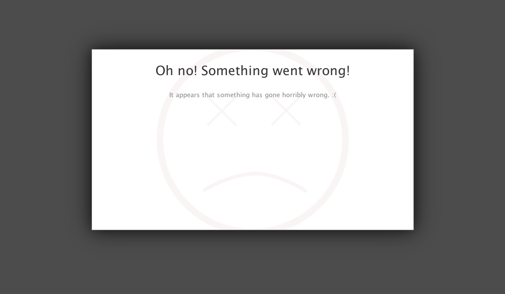
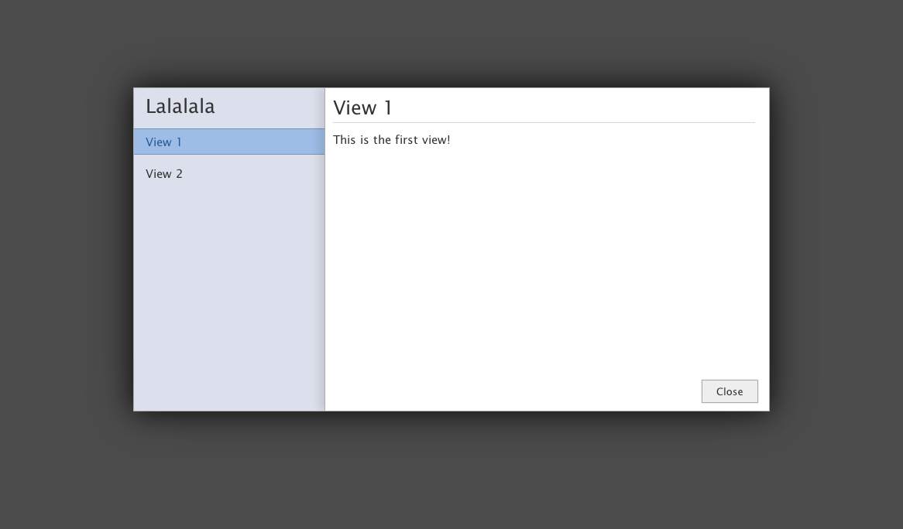
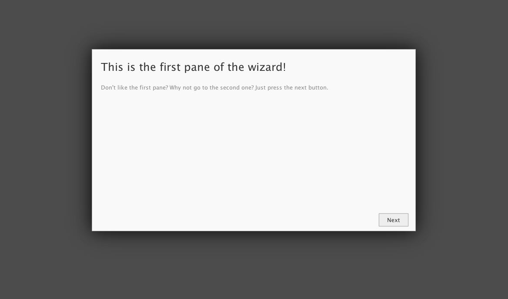

#ModalDialogue

ModalDialogue is a Javascript module that (you guessed it) creates modal dialogues. 

ModalDiaogue supports three types of modal dialogue:

- Single dialogue
- Multi-view dialogue
- Wizard dialogue

Each type of dialogue takes a Modal Dialouge Definition (MDD), or a series of MDDs, which allow the specification of a dialogue. The definition of an MDD is defined in __Usage__.

##Support

ModalDialogue has been tested in IE8+, Chrome, FireFox 3.6+ and Opera.

##Usage

This section will document the three methods for creating dialogues and the Modal Dialouge Definition. It will also document the DOM structure of the dialogue so that it can be themed with custom CSS.

###MDD

The Modal Dialogue Definition (MDD) is an object literal definition of a modal dialogue. The MDD (or MDDs) is passed to the constructor method, which then generates a DOM structure and presents it.

Each heading below refers to a property of the MDD, a minimal MDD only needs a title and body property, if it does not have these properties it is an invalid MDD and the constructor will throw an exception.

Some constructor methods extend the MDD specification, for example, if a multi view dialogue is being constructed a navTitle property can be used, but is otherwise ignored. MDD extensions are documented in the constructor usage specification.

####MDD.title {string}

The title property is a simple string that will be used as a title in the dialogue.

	var MDD = {
		'title' : 'Hello World'
	}

__Note__: the above is not a valid MDD as it does not have a body property.

####MDD.body {string|array}

The body property specifies the main text used within the dialogue. The property can be an array of strings or a lone string, these strings can contain HTML.

If the string is not wrapped in an HTML tag it will be automatically wrapped in a &lt;p&gt; tag.

	var MDD = {
		'title' : 'Hello World',
		'body' : ['<h2>This is a sub-title.</h2>','This will be wrapped in a paragraph.', '']
	}

####MDD.buttons {object}
The buttons property allows dialogue buttons to be defined using the property name as the text in the button, and the value of the property as the calback function.

If the property contains an object then it will be assumed that that object contains a __title__ and __callback__ property for the title of the button and the function executed when the button is pressed respectively.

The callback is called in the context of the ModalDialogue object, enabling you to use properties of the ModalDialogue object such as close and open. This allows you to write a custom close button.

	var MDD = {
		'title' : 'Hello World',
		'body' : 'Lorum Ipsum',
		'buttons' : {
			'Close' : function() {
			
				// cleanup stuff.
				
				// actually close the dialogue.
				this.close()
			
			}
		}
	}

It is also possible to have the callback executed under a custom context by specifying the button as an object and adding a __context__ property.

	var foo = {
		bar : function() { console.log('Custom context FTW!') }
	}
	
	var MDD = {
		'title' : 'Hello World',
		'body' : 'Lorum Ipsum',
		'buttons' : {
			'my custom button' : {
				'title' : 'Click.',
				'callback' : function() {
					this.bar()
				}
				'context' : foo
			}
		}
	}

####MDD.form {object}

The form property defines a form within the dialogue that will be displayed after the body text. The form object requires the following properties:

- __name__ - {string} the name of the form.
- __inputs__ - {array} input objects. (defined below)
- __callback__ - {function} function called when enter is pressed or the button is clicked.
- __buttonTitle__ - {string} title of the form button. Optional, defaults to 'Apply'.

An input object has the following properties:

- __name__ -  identifier for the input.
- __type__ - type of input. Optional, defaults to text.
- __options__ - if the type is 'select', options is an array of choices.
- __placeholder__ - Placeholder text for the input. Optional.

If the form callback is specified then a button will be injected named Apply, unless there is a buttonTitle property, in which case that text will be used as a title.

When the callback is executed it is passed an object containing the current values of the input as well as the placeholder text if it's specified.

Below is an example usage of the callback:

	var MDD = {
		'title' : 'Hello World',
		'body' : 'Lorum Ipsum',
		'form' : {
			'name' : 'lala',
			'callback' : function(inputs) {
			
				// use inputs...
			
			},
			'buttonTitle' : 'Save',
			'inputs' : [
				{
					'name' : 'host',
					'placeholder' : 'localhost'
				},
				{
					'name' : 'port',
					'type' : 'number',
					'placeholder' : 6232
				}
			]
		}
	}
	
The callback is also executed when the enter key is pressed whilst a form input is in focus.

####MDD.alignment

The alignment property can have any of the following values:

- __right__ - align the text to the right
- __left__ - align the text to the left
- __center__ - align the text to the center
- __justify__ - justify the text alignment

The default alignment is left.

####MDD.errorDialogue

If the errorDialogue property is true an error background will be set on the dialogue.

####MDD.customClass

If the customClass property is set then the specified class(es) will be set on the dialogue.

####MDD.animate

The animate property is an object with two properties:

- __in__ - the animation used when opening the dialogue.
- __out__ - the animation used when closing the dialogue.

The out property can have any of the following properties:

- __fadeOut__ - fades the dialogue out using a disolve.
- __slideOutTop__ - slides the dialogue out to the top of the page.
- __slideOutBottom__ - slides the dialogue out to the bottom of the page.
- __slideOutLeft__ - slides the dialogue out to the left of the page.
- __slideOutRight__ - slides the dialogue out to the right of the page.

The in property can have any of the following properties:

- __fadeIn__ - fades the dialogue in using a disolve.
- __slideInTop__ - slides the dialogue in from the top of the page.
- __slideInBottom__ - slides the dialogue in from the bottom of the page.
- __slideInLeft__ - slides the dialogue in from the left of the page.
- __slideInRight__ - slides the dialogue in from the right of the page.

For example:

	var MDD = {
		'title' : 'Hello World',
		'body' : 'Lorum Ipsum',
		'animate' : {
			'in' : 'fadeIn',
			'out' : 'slideOutBottom'
		}
	}

__Note:__ Animation is only supported in CSS3-compliant browsers.

###Dialogue Constructors

The dialogue constructor methods are used to create different kinds of dialogue. The three constructors are:

- createSingle
- createMultiView
- createWizard

###ModalDialogue.createSingle

The createSingle method takes a single MDD as a parameter and will construct and display that dialogue. createSingle is the simples constructor method as it simply uses an MDD.

###ModalDialogue.createMultiView

The createMultiView constructor method allows a complex view-based dialogue to be created that allows switching between views using a navigation panel.

To acommodate this new structure this constructor takes an Multi-View Definition (MVD) object as a definition for the dialogue. The MVD is defined as follows:

- __views__ - {array} MDDs representing the individual views.
- __title__ - {string} title that appears above the navigation pane.
- __buttons__ - {object} this property follows the same specification as MDD.buttons.
- __animation__ - {object} this property follows the same specification as MDD.animation.

__Changes to the MDD:__

MDDs within a Multi-View Dialogue are changed slightly to accomodate the new structure, they have the following differences:

- The button property is ignored completely within individual MDDs. Instead, define buttons in the MVD.
- The animate property is ignored within the individual MDDs. Instead, define the animate property on the MVD.
- The navTitle property is added to the view as a shorter version of MDD.title displayed in the navigation sidebar. If unspecified, defaults to the title specification.

Below is an example of an MVD:

	var MVD = {
		'title' : "Hello World",
		'views' : [MDD1, MDD2, MDD3, ...],
		'buttons' : {close:true},
		'animate' : {
			'in' : "fadeIn",
			'out' : "slideOutBottom"
		}
	}

###ModalDialogue.createWizard

The createWizard constructor method creates a dialogue that allows switching between multiple dialogues using previous and next buttons.

The method accepts two parameters:

- __MDDs__ - {array} list of dialogues.
- __animate__ {object} animation property defined in MDD.animate.

MDD changes:

- Template functions for MDD.buttons.next and MDD.buttons.prev allowing automatic switching to the next and previous dialogues by specifying the property to be true.
- animate property is ignored in individual MDDs, instead use the second parameter.